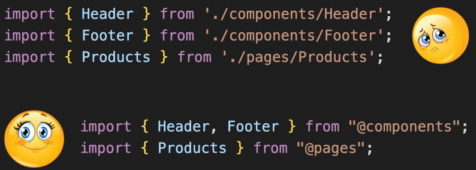
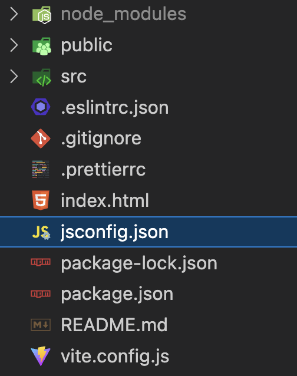

<center>
    
</center>

## Configurar Import Aliases no Vite

---

### Configurar path alias

1. Após criar seu projeto utilizando Vite acesse o arquivo **vite.config.js**:

   1.1. Adicionar o import do `path` para auxiliar a resolver os caminhos relativos em caminhos absolutos

   ```js
   import path from 'path';
   ```

   1.2. Adicionar a configuração dos paths, aqui deve ser adicionado todos os paths que você deseja que seja resolvido por um alias(apelido).

   ```js
   export default defineConfig({
     resolve: {
       alias: {
         '@components': path.resolve(__dirname, './src/components/index.js'),
         '@hooks': path.resolve(__dirname, './src/hooks/index.js'),
         '@pages': path.resolve(__dirname, './src/pages/index.js'),
         '@assets/*': path.resolve(__dirname, './src/assets/*'),
         '@service': path.resolve(__dirname, './src/service/index.js'),
       },
     },
     plugins: [react()],
   });
   ```

   Podemos deixar um caminho fixo apontando para um arquivo específico, como é o caso do `'@components': path.resolve(__dirname, './src/components/index.js')`, dessa forma o import ocorre da seguinte maneira: `import { MeuComp } from '@components'`.

   <br/>

   Podemos deixar um caminho relativo utilizando o _, como é o caso do `'@assets/_': path.resolve(\_\_dirname, './src/assets/\*')`, dessa forma o import ocorre da seguinte maneira: `import { MeuAsset } from '@assets/meuAsset'`.

   <br/>

2. Para que o VsCode consiga resolver os paths aliases e o intellisense funcione de forma adequada é necessário configurar o arquivo jsconfig:

   2.1. criar o arquivo **jsconfig.json** na raiz do projeto

   

   2.2. Após o arquivo criado é necessário adicionar as configurações dos paths:

   ```js
   {
      "compilerOptions": {
        "baseUrl": "./src",
        "jsx": "react",
          "paths": {
          "@components": ["./components/index.js"],
          "@hooks": ["./hooks/index.js"],
          "@pages": ["./pages/index.js"],
          "@assets/*": ["./assets/*"],
          "@service": ["./service/index.js"]
        }
      },
      "include": ["./src"]
   }
   ```

   _Note que pelo fato da **baseUrl** estar definida como `'./src'` os paths são definidos apenas com a rota a partir do **src**._

3. Utilizar os imports no projeto:

```jsx
// Caso o path seja definido com caminho fixo para um arquivo
import { MeuComp } from '@components';

// Caso o path seja definido com *
import { MeuAsset } from '@assets/meuAsset';
```
