<center>
    
</center>

## Instalar ESLINT no Vite

---

### Instalação do ESLINT

1. Após criar o seu projeto com o Vite, rode o seguinte comando:

   ```bash
   npm init @eslint/config
   ```

2. Escolha uma das opções que aparecerão no console (recomandado: terceira opção)

   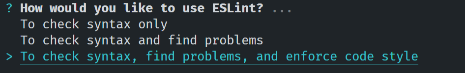

3. Escolha JavaScript modules

   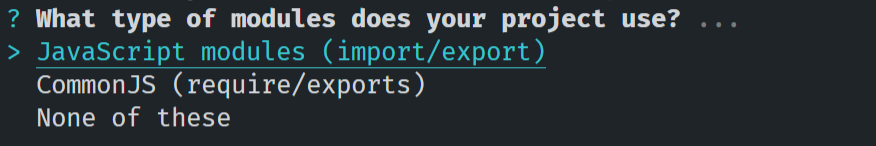

4. Escolha a opção React

   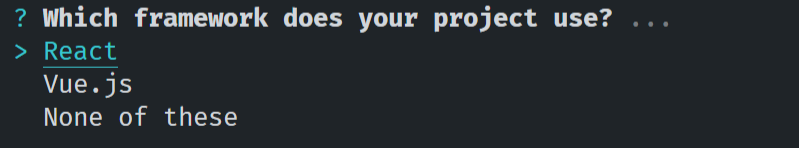

5. Se o seu projeto não usa Typescript, escolha “no”

   

6. Selecione ambas as opções usando a barra de espaço

   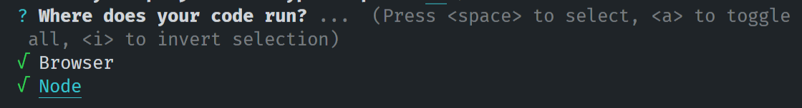

7. Escolha como você quer configurar as regras (recomendado: use a popular style guide)

   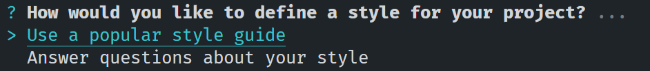

8. Escolha a opção “standard” (é a mais comum, mas se quiser testar as outras, sinta-se a vontade)

   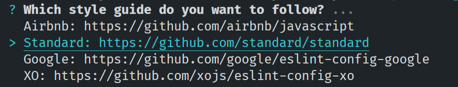

9. Escolha a opção JSON

   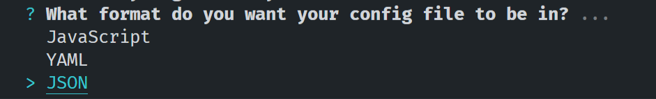

10. Escolha yes para instalar as dependencias necessárias

    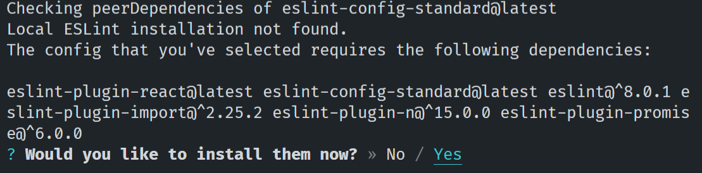

11. Escolha o gerenciador de dependencias do seu projeto (recomendado: npm)

    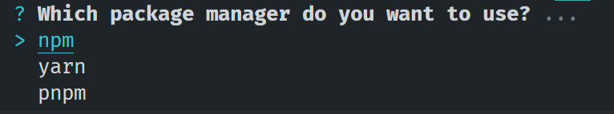

12. Na raiz do seu projeto deverá ter sido criado um arquivo .eslintrc.json

    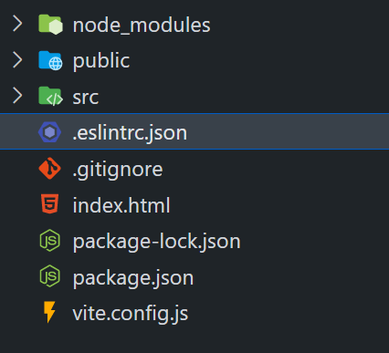

---

### Instalação e configuração das demais dependências

1. Digite o seguinte comando para instalar todas as dependências que vamos precisar no projeto:

   ```bash
   npm install -D eslint-config-prettier eslint-plugin-jsx-a11y eslint-plugin-react-hooks vite-plugin-eslint
   ```

2. Abra o arquivo `.eslintrc.json` na raiz do projeto e adicione uma propriedade `settings`, que será um objeto, conforme abaixo:

   ```jsx
   "settings": {
       "react": {
         "version": "detect"
       }
     }
   ```

3. Ainda no arquivo `.eslintrc.json` adicione, na propriedade existente `extends`, os valores conforme abaixo:

   ```jsx
   "extends": [
       "plugin:react/recommended",
       "plugin:react-hooks/recommended",
       "plugin:react/jsx-runtime",
       "plugin:jsx-a11y/recommended",
       "standard",
       "prettier"
     ],
   ```

4. Ainda no arquivo `.eslintrc.json` , em `plugins`, adicione “react” e “jsx-a11y” (note que, ao invés da letra L, usamos dois números “1”)

   ```jsx
   "plugins": ["react", "jsx-a11y"],
   ```

5. Abra o arquivo `package.json` e configure um script de execução do linter

   ```jsx
   "scripts": {
       "dev": "vite",
       "build": "vite build",
       "preview": "vite preview",
       "start": "vite build & vite preview",
       "lint": "eslint src/**/*.{js,jsx}"
     },
   ```

6. Abra o arquivo `vite.config.js`, importe a função eslint do pacote “vite-plugin-eslint” e chame-a no array de plugins do objeto de configuração:

   ```jsx
   // ...
   import eslint from 'vite-plugin-eslint';

   // ...
   export default defineConfig({
     plugins: [react(), eslint()],
   });
   ```

7. Por último, adicione o [plugin do ESLint no VSCode](https://marketplace.visualstudio.com/items?itemName=dbaeumer.vscode-eslint) para ter feedback visual das regras

   

---

### Definindo regras customizadas

No ESLint podemos definir o comportamento de algumas regras da nossa maneira. Para fazer isso, basta editar a propriedade “rules” do arquivo `.eslintrc.json`

```jsx
"rules": {
    "prefer-const": "warn"
  }
```

Podemos encontrar o nome da variável posicionando o mouse sobre o erro e verificando a mensagem retornada pelo VSCode:


Neste exemplo, vemos que a regra é a `no-unused-vars`

```jsx
"rules": {
    "prefer-const": "warn",
    "no-unused-vars": "off"
  }
```

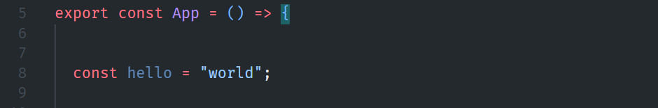
