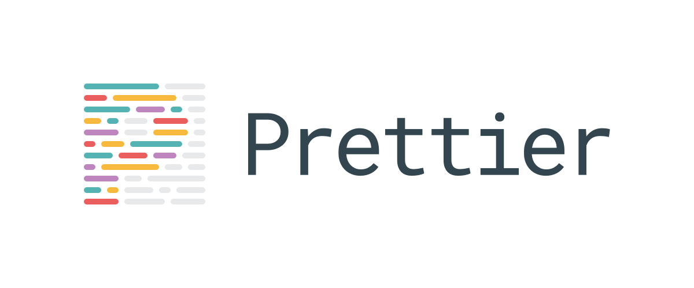
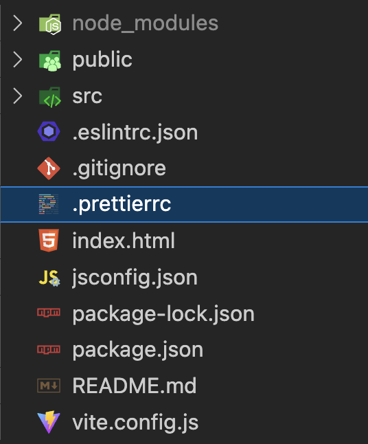
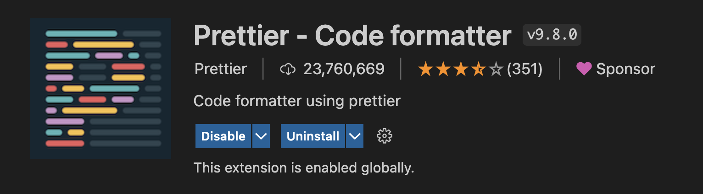
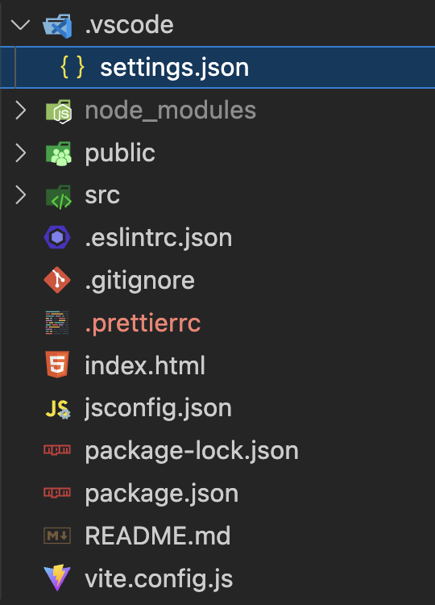

<center>
    
</center>

## Configurar Prettier e Adicionar configurações do Visual Studio Code

---

### Configurar Prettier

1. Após criar o seu projeto com o Vite, rode o seguinte comando:

   ```bash
   npm install prettier eslint-config-prettier eslint-plugin-prettier --save-dev
   ```

2. Configurar o Prettier

   2.1. Vamos precisar na raiz do projeto um arquivo chamado **.prettierrc**, ele será reponsável por armazenar todas as configurações que desejamos utilizar no projeto.

   

   2.2. Adicionar as configurações desejadas:

   ```json
   {
     "tabWidth": 2,
     "semi": true,
     "singleQuote": false,
     "bracketSpacing": true,
     "trailingComma": "all",
     "printWidth": 80,
     "useTabs": false,
     "endOfLine": "auto"
   }
   ```

   _Mais opcões de configurações podem ser acessadas [aqui](https://prettier.io/docs/en/options.html)_

   2.3. Abra o arquivo `package.json` e configure um script de execução do prettier

   ```json
   "scripts": {
      "dev": "vite",
      "build": "vite build",
      "preview": "vite preview",
      "format": "prettier src/**/*.{js,jsx} --write"
   }
   ```

3. Adicionar o [plugin do Prettier no VSCode](https://marketplace.visualstudio.com/items?itemName=esbenp.prettier-vscode) para ter feedback visual das regras

   

### Configurar Visual Studio Code

1. Podemos definir algumas configurações padrões do VsCode por projeto.

   1.1. Criar na raiz uma pasta chamada **.vscode** e dentro dela um arquivo chamado **settings.json**

   

   1.2. Adicionar configurações no arquivo `settings.json`:

   ```json
   {
     "editor.formatOnSave": true,
     "editor.codeActionsOnSave": {
       "source.fixAll.eslint": true
     }
   }
   ```

   _As configurações disponíveis nesse aquivo são as mesmas que as do proprio [VsCode](https://code.visualstudio.com/docs/getstarted/settings)_
